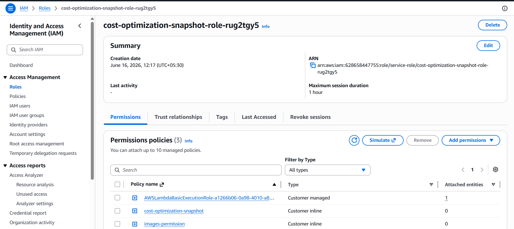
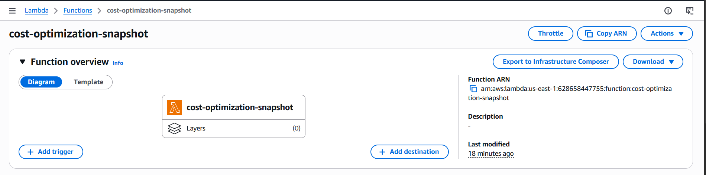
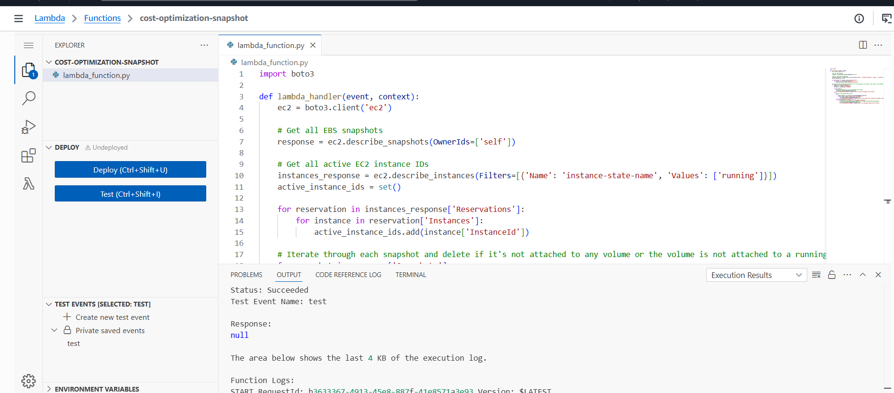
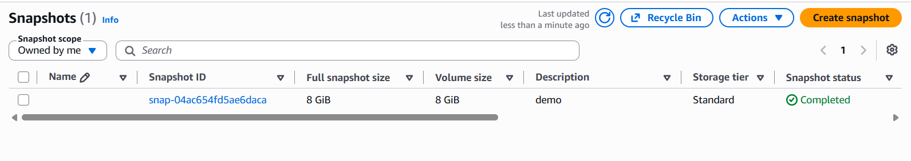
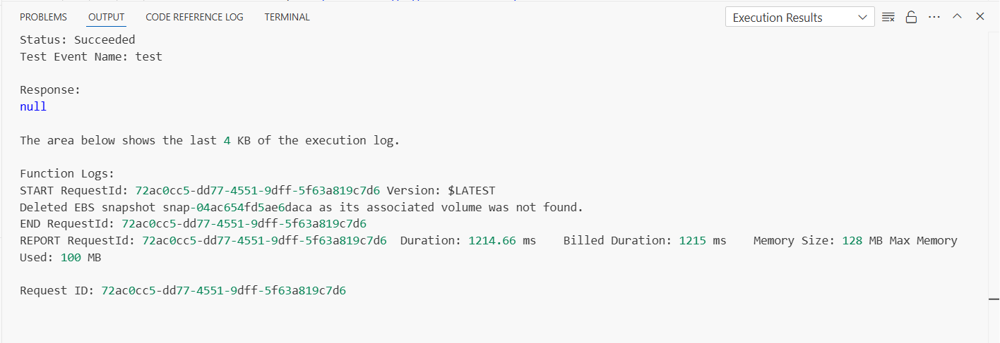
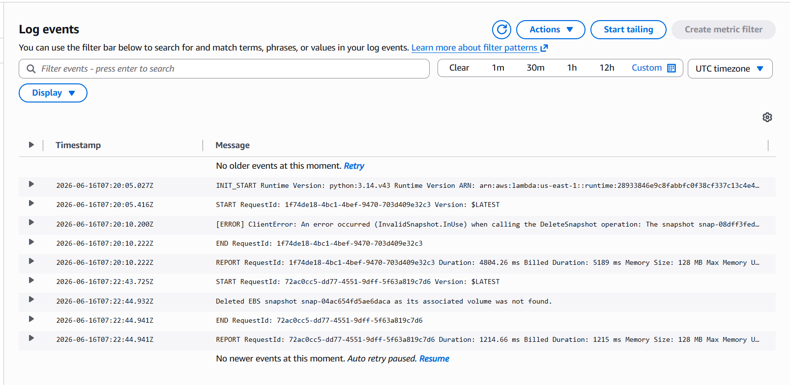
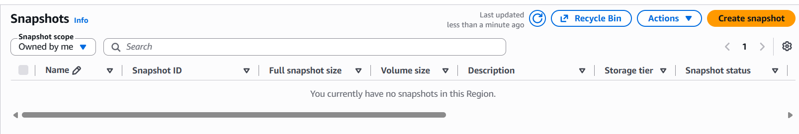

# AWS Cloud Cost Optimization — Identifying Stale EBS Snapshots

## 📌 Problem Statement

In AWS, EBS snapshots accumulate over time even after their associated EC2 instances or volumes are deleted. These orphaned snapshots silently consume storage and incur unnecessary costs. Manual identification is tedious and error-prone at scale.

## 💡 Solution

An automated AWS Lambda function that:
- Fetches all EBS snapshots owned by the account
- Retrieves all active EC2 instances (running and stopped)
- Identifies snapshots whose associated volume is no longer attached to any active instance
- Automatically deletes stale snapshots to reduce storage costs

---

## 🏗️ Architecture

```
AWS Account
    │
    ├── Lambda Function (cost-optimization-snapshot)
    │       │
    │       ├── Scans → EBS Snapshots (EC2)
    │       ├── Checks → Active EC2 Instances
    │       └── Deletes → Stale/Orphaned Snapshots
    │
    ├── IAM Role (least-privilege permissions)
    │       ├── AWSLambdaBasicExecutionRole
    │       ├── cost-optimization-snapshot policy
    │       └── images-permission policy
    │
    └── CloudWatch Logs (execution monitoring)
```

---

## 🛠️ AWS Services Used

| Service | Purpose |
|---|---|
| AWS Lambda | Serverless function execution |
| Amazon EC2 | Source of snapshots and active instance data |
| Amazon EBS | Snapshot storage being optimized |
| AWS IAM | Least-privilege role for Lambda |
| Amazon CloudWatch | Execution logs and monitoring |

---

## 📋 How It Works

See [lambda_function.py](lambda_function.py) for the full source code.

The function works in 3 steps:
1. Fetches all EBS snapshots owned by this AWS account
2. Gets all active EC2 instance IDs (running and stopped)
3. For each snapshot — if the associated volume is not found or not attached to any active instance, the snapshot is deleted automatically

---

## 🔐 IAM Role & Permissions

The Lambda function uses a dedicated IAM role with least-privilege permissions — only the access it needs, nothing more.



**Policies attached:**
- `AWSLambdaBasicExecutionRole` — allows Lambda to write logs to CloudWatch
- `cost-optimization-snapshot` — custom policy for EC2/EBS describe and delete operations
- `images-permission` — permission to describe images

---

## 📸 Project Screenshots

### Lambda Function Overview


### Lambda Code + Successful Execution


### Before: Stale Snapshot Exists
Snapshot `snap-04ac654fd5ae6daca` (8 GiB, description: "demo") with no active EC2 association.



### Lambda Execution Result
Status: **Succeeded**
Log confirms: `Deleted EBS snapshot snap-04ac654fd5ae6daca as its associated volume was not found.`



### CloudWatch Logs
Full execution trace showing the snapshot identification and deletion event.



### After: Snapshot Deleted
`"You currently have no snapshots in this Region."` — stale snapshot successfully removed.



---

## ✅ Results

| Metric | Value |
|---|---|
| Stale snapshots identified | 1 |
| Stale snapshots deleted | 1 |
| Storage recovered | 8 GiB |
| Lambda execution time | ~1214 ms |
| Memory used | 100 MB / 128 MB |

---

## 🚀 How to Deploy This Yourself

**Prerequisites:**
- AWS account with appropriate permissions
- Python 3.x

**Steps:**

1. Go to AWS Lambda → Create Function
2. Runtime: Python 3.14
3. Copy the `lambda_function.py` code
4. Create an IAM role with EC2 describe and delete snapshot permissions
5. Attach the IAM role to your Lambda function
6. Create a test event (empty JSON `{}` works)
7. Deploy and run

**To test properly:**
- Create a dummy EBS snapshot (EC2 → Snapshots → Create Snapshot)
- Make sure it has no active volume association
- Run the Lambda function
- Verify the snapshot is deleted

---

## 💰 Cost Impact

EBS snapshot storage costs approximately **$0.05 per GB-month** in us-east-1.

Automating this cleanup across a production AWS account with dozens of stale snapshots can save **hundreds of dollars per month** depending on scale.

---

## 🔧 Possible Improvements

- Add EventBridge (CloudWatch Events) trigger to run this automatically every week
- Add SNS notification to send email report of deleted snapshots
- Extend to also clean up unused EBS volumes
- Add a "dry run" mode that lists stale snapshots without deleting them
- Tag-based exclusion — skip snapshots tagged as `retain: true`

---

## 📚 What I Learned

- How AWS Lambda integrates with EC2 and EBS using Boto3
- IAM least-privilege principle in practice
- Reading and interpreting CloudWatch execution logs
- Real-world cloud cost optimization patterns used in production environments

---

## 👤 Author

**Saif Attar**
- LinkedIn: [linkedin.com/in/saif-attar-b15775346](https://linkedin.com/in/saif-attar-b15775346)
- GitHub: [github.com/SaifAttar003](https://github.com/SaifAttar003)

---

## 📄 License

MIT License
